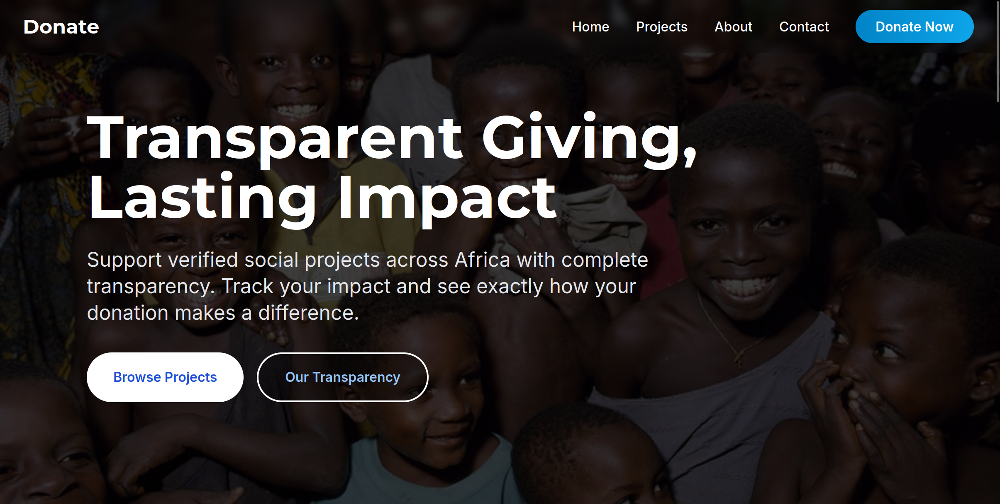

# African Social Projects Donation Platform



A production-ready web application built with SvelteKit, PostgreSQL, and Redis that enables secure donations to various social projects in Africa through M-Pesa integration.

## Features

- Anonymous and authenticated donations to social projects
- Secure M-Pesa integration for mobile payments
- Admin dashboard with real-time analytics
- Rate limiting and security measures
- Caching with Redis
- Comprehensive logging and monitoring
- African-themed responsive UI
- PostgreSQL database with migrations
- Docker deployment support

## Prerequisites

- Node.js (v18 or later)
- PostgreSQL (v15 or later)
- Redis (v7 or later)
- Docker and Docker Compose (for containerized deployment)
- M-Pesa Daraja API credentials

## Local Development Setup

1. Clone the repository:
```bash
git clone <repository-url>
cd donation-app
```

2. Install dependencies:
```bash
npm install
```

3. Create a `.env` file in the root directory (see `.env.example` for required variables)

4. Start the development environment:
```bash
# Start PostgreSQL and Redis using Docker
docker-compose up -d db cache

# Initialize the database
npm run migrate:dev

# Seed the database with sample data
npm run seed
```
4. Start the production server:
```bash
npm run start
```
## Contributing

1. Fork the repository
2. Create a feature branch
3. Commit your changes
4. Push to the branch
5. Create a Pull Request

## License

This project is licensed under the MIT License - see the LICENSE file for details.


## Acknowledgments

- SvelteKit for the framework
- Prisma for database ORM
- Tailwind CSS for styling
- M-Pesa for payment integration 
